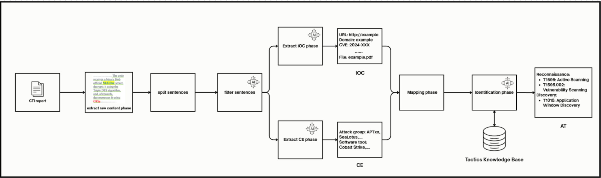

# Khung trích xuất kỹ thuật tấn công tự động dựa trên mô hình ngôn ngữ lớn với phân tích đa cấp độ từ và câu (An Automatic Attack Technique Extraction Framework Based on Large Language Models via Word- and Sentence-Level Analysis)
## Mục lục
- [Tổng quan](#tổng-quan)
- [Kiến trúc](#kiến-trúc) 
- [Cài đặt](#cài-đặt)
## Tổng quan
Hiện nay, các cuộc tấn công có chủ đích nhằm vào các cơ quan, doanh nghiệp ngày càng gia tăng với mức độ tinh vi ngày càng cao. Để phòng ngừa và phát hiện sớm các cuộc tấn công này, các báo cáo thông tin tình báo về mối đe dọa mạng (Cyber Threat Intelligence report) đóng vai trò quan trọng trong việc cảnh báo và hỗ trợ xây dựng các biện pháp ứng phó phù hợp. Tuy nhiên, phần lớn các báo cáo CTI hiện nay chưa có cấu trúc rõ ràng và thường thiếu các thông tin quan trọng như kỹ thuật tấn công Mitre ATT&CK và chỉ số xâm nhập (IOC), gây khó khăn cho các hệ thống phát hiện xâm nhập trong việc đưa ra cảnh báo sớm. Trước thực trạng đó, chúng tôi đề xuất một khung trích xuất kỹ thuật tấn công tự động dựa trên mô hình ngôn ngữ lớn với phân tích đa cấp độ từ và câu (An Automatic Attack Technique Extraction Framework Based on Large Language Models via Word- and Sentence-Level Analysis), lấy cảm hứng từ nghiên cứu [AECR: Automatic attack technique intelligence extraction based on fine-tuned large language model](https://www.sciencedirect.com/science/article/abs/pii/S0167404824005194).

## Kiến trúc


Kiến trúc của khung sẽ có 5 giai đoạn tương ứng với 6 node ở trong source code: 
- Giai đoạn 1: Trích xuất văn bản thuần và phân tách câu (node 1: crawl and split). Ở giai đoạn này, hệ thống sẽ thu thập dữ liệu HTML từ đường dẫn URL do người dùng cung cấp, sau đó chuyển đổi thành văn bản thuần. Tiếp theo, văn bản này được phân tách thành các câu riêng biệt nhằm hỗ trợ quá trình lọc các câu không chứa kỹ thuật tấn công Mitre ATT&CK. Hiện tại, khung chỉ hỗ trợ thu thập dữ liệu từ website ở định dạng HTML và chưa hỗ trợ đầu vào là file PDF.  
- Giai đoạn 2: Lọc câu (node 2: filter agent). Trong giai đoạn này, hệ thống sử dụng LLM Agent để tự động phân tích và loại bỏ các câu không chứa thông tin về kỹ thuật tấn công Mitre ATT&CK, giúp tập trung vào các câu có giá trị phục vụ cho quá trình nhận diện và phân tích mối đe dọa.  
- Giai đoạn 3: Trích xuất IOC (Indicators of Compromise) (node 3: extract IOC) và CE (Cyber Entity) (node 4: extract CE). Trong giai đoạn này, hệ thống LLM sẽ nhận diện và trích xuất các IOC và CE từ những câu đã được lọc ở bước trước, sau đó ánh xạ các thực thể này về dạng tổng quát (ví dụ: URL, IP, nhóm tấn công, công cụ,...) nhằm giúp mô hình ngôn ngữ lớn (LLM) nhận diện kỹ thuật tấn công chính xác hơn. Việc tổng quát hóa này khắc phục hạn chế khi LLM gặp các tên riêng hoặc thực thể đặc biệt, vốn dễ gây nhầm lẫn hoặc nhận diện sai trong quá trình phân tích.  
- Giai đoạn 4: Ánh xạ (node 5: mapping). Trong giai đoạn này, hệ thống sẽ thay thế các IOC và CE đã được nhận diện ở bước trước bằng các tên tổng quát như URL, IP, nhóm tấn công, công cụ,... trong các câu chứa các thực thể đó. Ví dụ, câu "Lotus use SPYware.exe" sẽ được chuyển thành "Attack group use Malware". Việc ánh xạ này giúp chuẩn hóa thông tin, hỗ trợ mô hình ngôn ngữ lớn nhận diện kỹ thuật tấn công một cách chính xác và nhất quán hơn.  
- Giai đoạn 5: Nhận diện kỹ thuật tấn công Mitre ATT&CK (node 6: identification agent). Trong giai đoạn này, hệ thống áp dụng kỹ thuật RAG (Retrieval-Augmented Generation) để mã hóa các kỹ thuật thuộc các tactic khác nhau trong Mitre ATT&CK thành một cơ sở dữ liệu gọi là Tactic Knowledge Base. Khi phân tích các câu đã được ánh xạ, hệ thống sẽ truy xuất các kỹ thuật tương đồng từ cơ sở dữ liệu này. Các kỹ thuật truy xuất được sẽ được sắp xếp lại thứ tự (reranking) theo mức độ tương đồng từ cao xuống thấp, giúp mô hình ngôn ngữ lớn (LLM) lựa chọn chính xác nhất các kỹ thuật phù hợp cho từng câu.  
## Cài đặt
Tạo file .env
```bash
echo -e "LANGCHAIN_API_KEY=\nLANGCHAIN_TRACING_V2=true" > .env
```
Tạo tài khoản langchain và lấy LANGCHAIN_API_KEY ở https://www.langchain.com/
```.env
LANGCHAIN_API_KEY="replace this by langchain api key"
LANGCHAIN_TRACING_V2=true
OLLAMA=false # true if use Ollama
BASE_URL= # If you do not specify a URL, the default OpenAI URL will be used.
MODEL=
API_KEY= 
```
Khởi động chương trình
```
cd src
langgraph dev
```